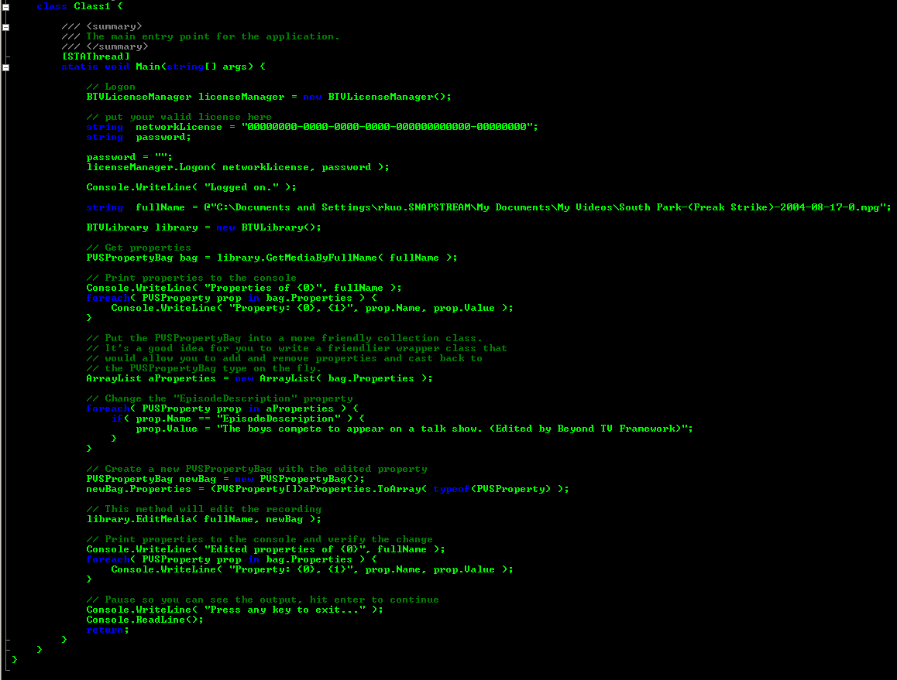

# Introduction to Computer Programming with Java
### The Programmer's Algorithm, Programming Concepts, and Java Basics

Brought to you by: 

*Author*: Sean Carrick, Owner/Lead Developer

## [Table of Contents]

i. [About the Author](chapters/front_matter/author.md)

ii. [Preface](chapters/front_matter/preface.md)

1. [The Java Programming Language](chapters/chapter1/java_language.md)
   1. [Fundamentals](chapters/chapter1/fundamentals.md)
   2. Tools
   3. Features
   4. Creating a Terminal Project
   5. Creating a Desktop Project
   5. Conclusion
2. Apache NetBeans IDE
   1. Fundamentals
   2. Tools
   3. Features
   4. Creating a Terminal Project
   5. Creating a Desktop Project
   6. Conclusion
3. The Programmer's Algorithm
   1. The Idea
   2. Planning the Project
   3. Designing the Project
   4. Developing the Project
   5. Testing the Project
   6. Releasing the Project
   7. Maintaining the Project
   8. Conclusion: Wash, Rinse, Repeat
4. Creating Our Main Project
   1. The Idea
   2. Planning the Project
      1. The Application Data
      2. The Data Storage
   3. Developing the Project
      1. The `Recipe` Data Object
      2. The `Ingredient` Data Object
      3. The `Category` Data Object
      4. The `Cuisine` Data Object
      5. Throwing Exceptions
   4. Testing the Project
   5. Conclusion: Revising the Data Classes
5. Creating the Data Files
   1. The Idea
   2. Planning the Files
      1. File Access in Java
      2. Planning Our Files
      3. Deciding How to Store Data
   3. Developing the Files
      1. Creating Our File Access Class(es)
      2. Trapping Exceptions
      3. When to Throw and When to Catch
   4. Testing the Files
   3. Conclusion: Better Data Access